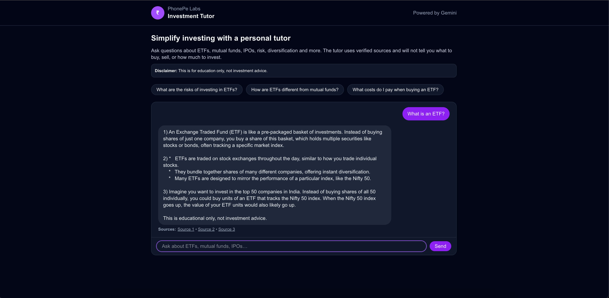

# 📚 Investment Tutor (Share.Market Helper)

*A learning-first, safe, citation-backed tutor that helps users understand investment concepts using verified Share.Market sources.*

---

## 🧩 Background

PhonePe’s Home Screen currently shows **too many investment entry points**, causing:

* Information overload
* Confusion about where to start
* Dependence on agents for basic understanding
* Low awareness of the **Share.Market** educational content already available

Users want to understand concepts, not navigate complex menus.

They also want **trustworthy**, jargon-free answers without risking money or relying on agents.

---

## 🎯 Goal

Design an **MVP learning experience** inside PhonePe that:

* Helps users understand investment basics (ETFs, mutual funds, IPOs, risk, diversification, etc.)
* Provides **simple, safe explanations** backed by verified content
* Eliminates the need for external agents
* Reduces cognitive load
* Improves awareness of Share.Market resources

This solution is **not** designed for trading—it is built purely for **education**.

---

# ⭐ Core Features

### ✅ 1. Retrieval-Augmented Answers (No Hallucination)

The tutor uses a **RAG pipeline**:

1. User asks a question
2. System generates an embedding using **Gemini (`text-embedding-004`)**
3. Embedding is matched against **chunked Share.Market content** stored in Supabase
4. Gemini 1.5 Flash answers **only using the retrieved context**

If the answer is not in the verified data, the tutor explicitly says:

> “I don’t know based on my verified sources.”

This keeps the system factual and safe.

---

### ✅ 2. Strict Safety Guardrails

The tutor refuses:

* Buy/sell recommendations
* How much to invest
* Stock predictions
* Personalized financial guidance

Instead it explains concepts in:

* 2–3 lines
* 3 bullet points
* 1 simple example

Every answer ends with:

> “This is educational only, not investment advice.”

---

### ✅ 3. Citation Layer (Hyperlinked Sources)

Every bot response includes clickable citations:

```
Sources: Source 1 • Source 2 • Source 3
```

Each link goes back to the original Share.Market learning article.

This increases **trust** and directs users into PhonePe’s investment ecosystem.

---

## 🧱 Architecture Overview

```
Next.js (Frontend)
│
└── /api/ask (Server Route)
      ├── Gemini text-embedding-004 → Create embedding
      ├── Supabase RPC → match_chunks()
      ├── Build verified context
      ├── Gemini 1.5 Flash → Generate final answer
      ├── Apply safety guardrails
      └── Return answer + citations
```

### **Supabase Storage**

* `documents` table → Each article/link
* `chunks` table → Clean text chunks + embeddings
* `match_chunks()` RPC → Finds the top 5 most relevant entries by similarity

---

## 🛡 Why This Approach Works

### **1. No Hallucinations**

All responses must reference real, ingested Share.Market pages.

### **2. Transparent & Trustworthy**

Users see exactly where the answer came from.

### **3. Lightweight & Fast**

Gemini 1.5 Flash gives instant responses with verified context.

### **4. Compliant with financial regulations**

Because it never gives investment advice—only explanations.

---

# 📈 Business Impact

### **1. Increases awareness of Share.Market**

Users discover structured learning pages they didn’t know existed.

### **2. Reduces agent dependency and commission leakage**

Users learn concepts on their own without intermediaries.

### **3. Builds early-stage trust**

Clear, jargon-free, verified explanations improve confidence.

### **4. Supports user activation funnel**

Educated users are more likely to explore PhonePe’s investment products.

---

## 📸 Screenshots



---

# 🏁 Summary

This MVP demonstrates how PhonePe can deliver a **trusted investment education experience** that:

* Reduces confusion
* Lowers cognitive load
* Uses PhonePe’s existing knowledge base
* Helps millions of first-time investors learn safely
* Drives awareness toward Share.Market

It is simple, fast, safe, and designed for the real needs of Indian first-time investors.

